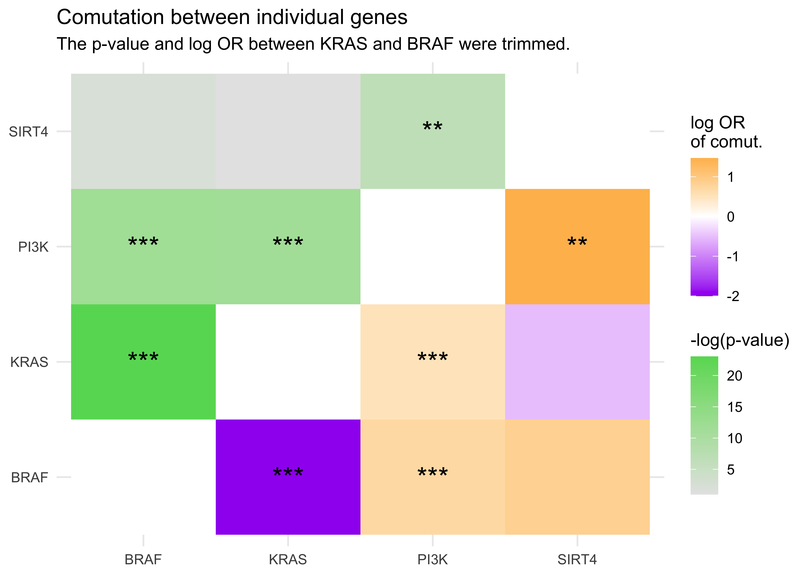
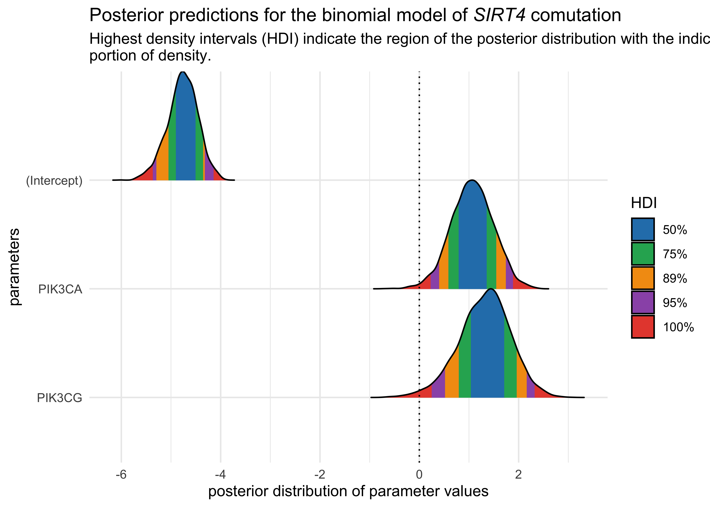
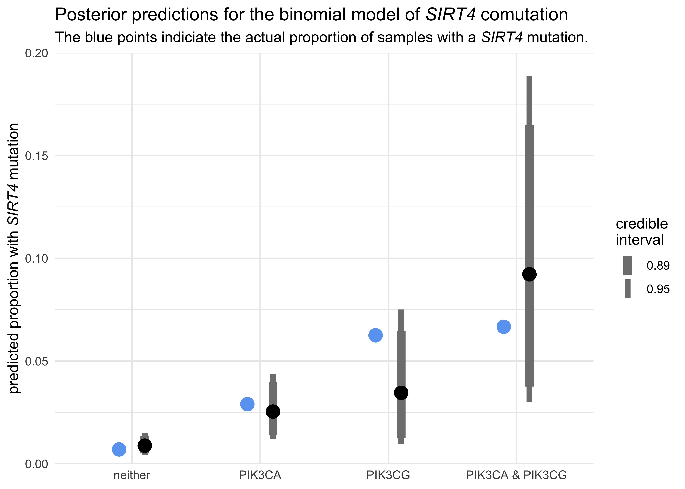

*SIRT4* comutations in CRC
================
Joshua Cook
6/15/2020

## Directive from Prof. Kevin Haigis

> A very important collaborator is trying to finish up a grant on SIRT4
> in colon cancer. SIRT4 mutation is rare, but I noticed from a quick
> check of cBioportal that when SIRT4 is mutant, KRAS mutations are
> infrequent (20%), PIK3CA mutations are frequent (almost 50%), and BRAF
> mutations are frequent (26%).
> 
> 1.  Could you please do a more rigorous analysis of this in your
>     larger dataset? I believe that PI3K pathway mutations are even
>     more frequent than just looking at PIK3CA. Could you include PTEN
>     and PIK3CG in a separate analysis?
> 2.  We would like to include SIRT4 deletion in addition to mutation,
>     since this is a more frequent event. Is that possible?
> 3.  Also, my suspicion is that BRAF is enriched because it co-mutated
>     with PIK3CA. Would you agree?

## Analyses

Follow the steps listed below to re-run the analysis on O2:

1.  Run `Rscript src/get-data-from-comutation-project.R` to get the data
    from the *KRAS* comutation analysis.
2.  Run `Rscript -e
    rmarkdown::render('src/sirt4-comutation-analysis.Rmd')`

## Conclusions

There were patterns of comutation between *SIRT4* and the key members of
the PI3K signaling pathway, particularly with *PIK3CA* and *PIK3CG*.

These genes were also identified as strong predictors of a *SIRT4*
mutation in a binomial model.

