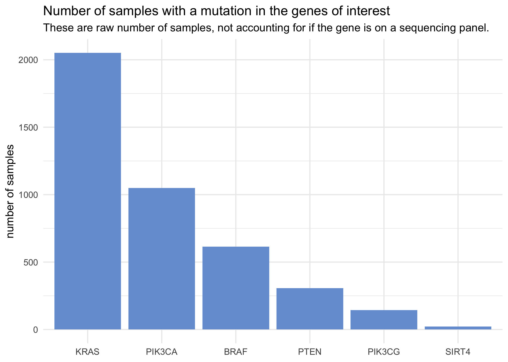
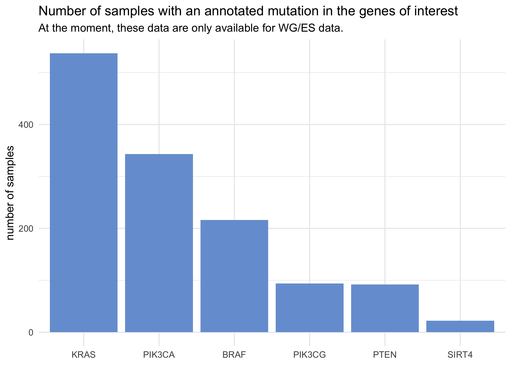
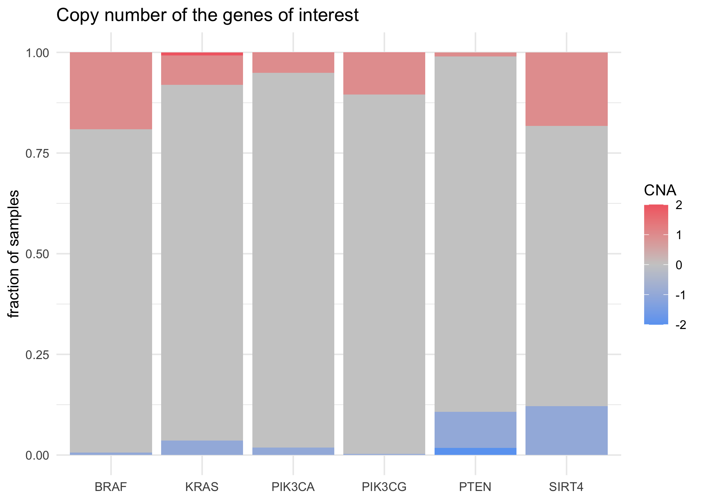
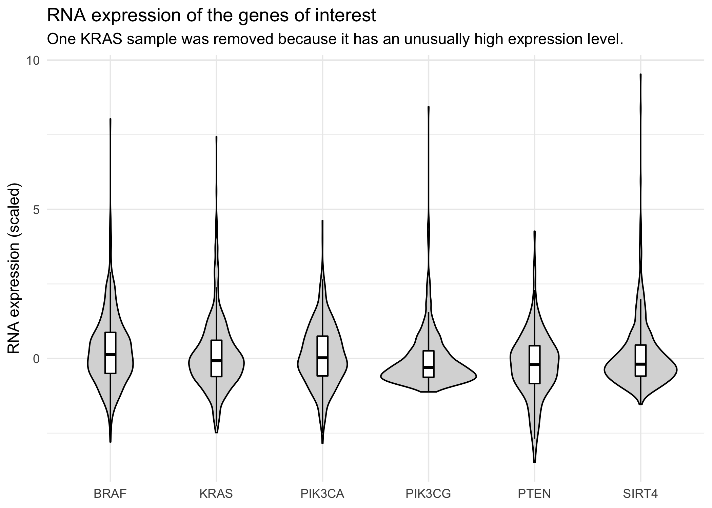
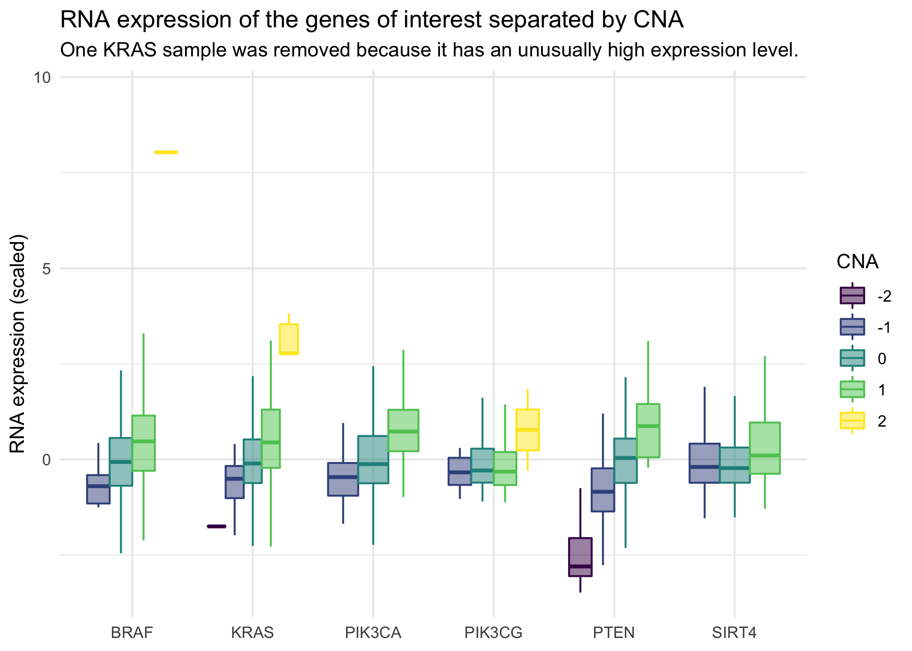
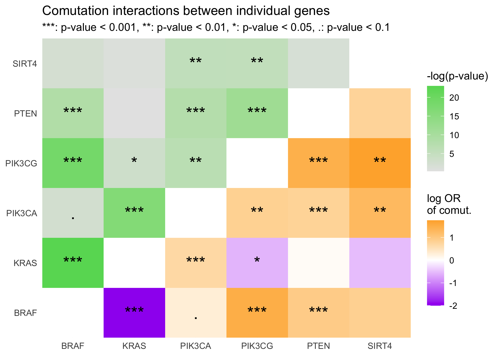
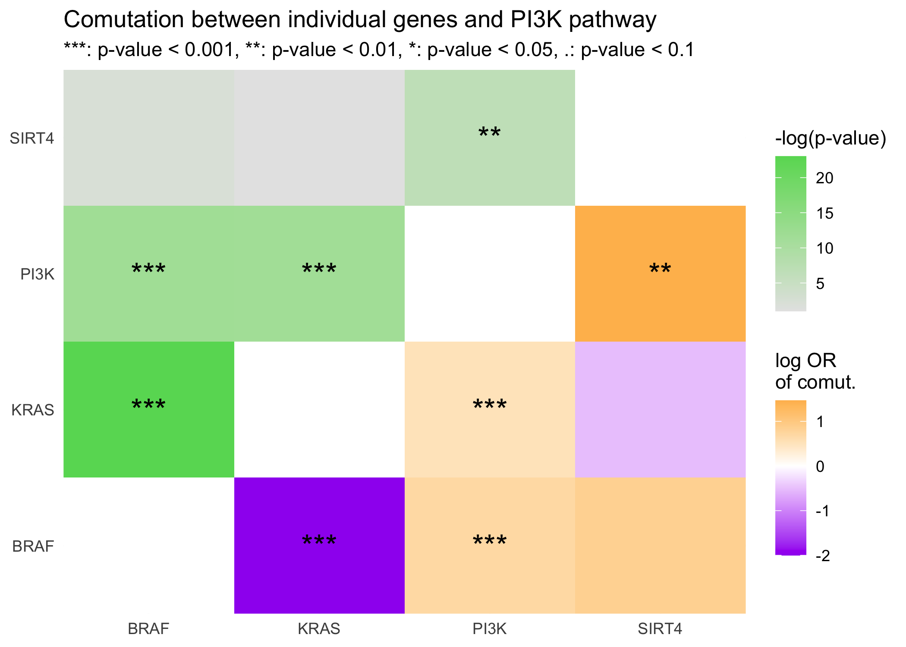
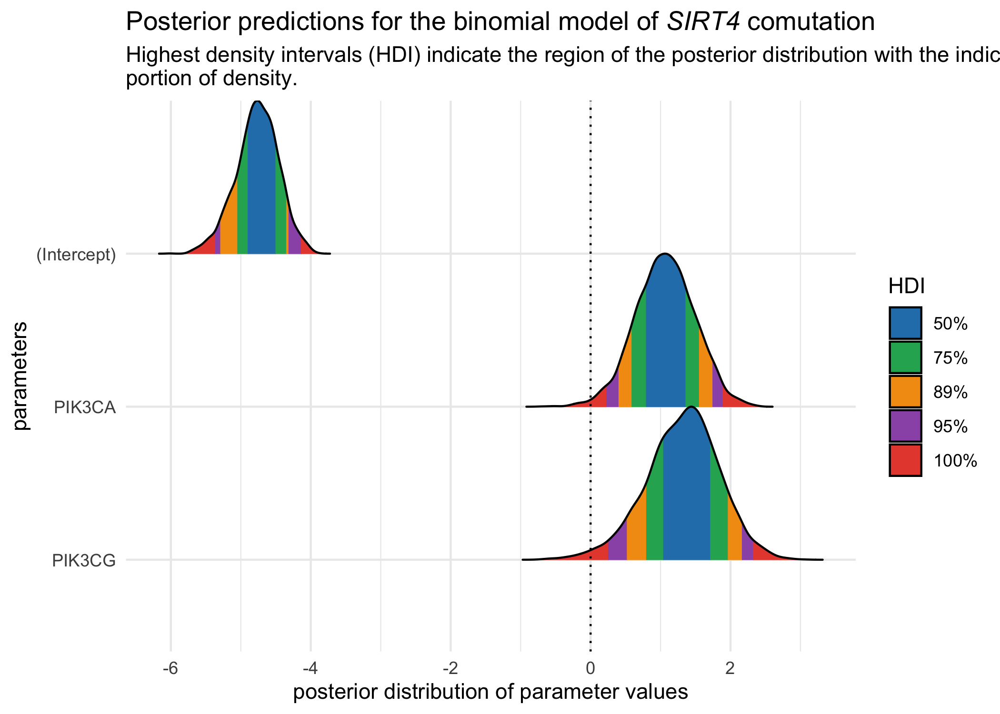
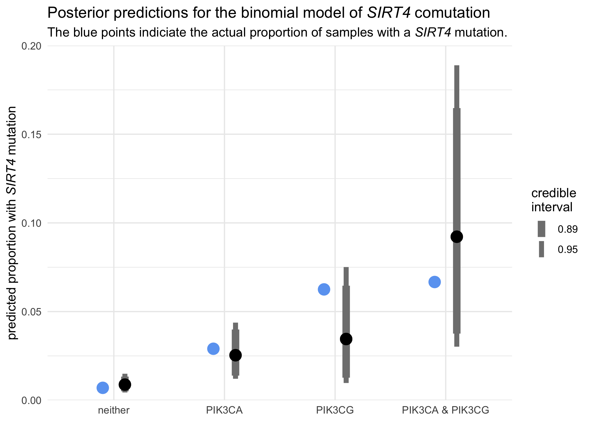

*SIRT4* comutations in CRC
================
Joshua Cook
6/15/2020

## Setup

``` r
knitr::opts_chunk$set(echo = TRUE, comment = "#>", dpi = 300, cache = TRUE, 
                      message = FALSE, warning = FALSE)

library(glue)
library(jhcutils)
library(mustashe)
library(magrittr)
library(ggasym)
library(MASS)
library(tidybayes)
library(rstanarm)
library(bayestestR)
library(see)
library(ggtext)
library(tidyverse)
library(conflicted)

conflict_prefer("filter", "dplyr")
conflict_prefer("select", "dplyr")

theme_set(theme_minimal())

blue <- "#6ba5f2"
pastel_blue <- "#769fd6"
red <- "#f26b72"
pastel_red <- "#d6767b"
green <- "#66d962"

# To shut-up `summarise()` in dplyr 1.0.0
options(dplyr.summarise.inform = FALSE)

set.seed(0)
```

``` r
# Set up files in "lib".
walk(list.files("lib", full.names = TRUE, pattern = "R$"), source)
```

``` r
# Set up data file paths.
cancer_full_coding_muts_df_path <- file.path("data",
                                             "cancer_full_coding_muts_df.tsv")
coad_cna_path <- file.path("data", "coad_cna_df.tsv")
coad_rna_path <- file.path("data", "coad_rna_df.tsv")
mutation_data_annotated_path <- file.path("data",
                                          "mutation_data_annotated.tsv")
```

# Data overview

## Coding mutation data

Get all the mutations in the genes of interest.

``` r
stash("goi_mutations", 
      depends_on = c("full_coding_muts_cols", "genes_of_interest"),
{
    read_full_coding_muts <- function(df, ...) {
        df %>%
            filter(hugo_symbol %in% genes_of_interest)
    }
    
    goi_mutations <- read_tsv_chunked(
        cancer_full_coding_muts_df_path,
        DataFrameCallback$new(read_full_coding_muts),
        chunk_size = 1e5,
        col_types = full_coding_muts_cols
    )
})

goi_mutations
```

    #> # A tibble: 4,590 x 14
    #>    hugo_symbol tumor_sample_ba… mutation_type amino_acid_chan… dataset
    #>    <chr>       <chr>            <chr>         <chr>            <chr>  
    #>  1 BRAF        coadread_dfci_2… missense_mut… V600E            coadre…
    #>  2 KRAS        coadread_dfci_2… missense_mut… G13D             coadre…
    #>  3 KRAS        coadread_dfci_2… missense_mut… G12D             coadre…
    #>  4 PIK3CA      coadread_dfci_2… missense_mut… E545G            coadre…
    #>  5 KRAS        coadread_dfci_2… missense_mut… G13D             coadre…
    #>  6 BRAF        coadread_dfci_2… missense_mut… V600E            coadre…
    #>  7 KRAS        coadread_dfci_2… frame_shift_… K185Nfs*4        coadre…
    #>  8 PTEN        coadread_dfci_2… frame_shift_… K164Rfs*3        coadre…
    #>  9 KRAS        coadread_dfci_2… missense_mut… G13D             coadre…
    #> 10 KRAS        coadread_dfci_2… missense_mut… A146T            coadre…
    #> # … with 4,580 more rows, and 9 more variables: amino_position <dbl>,
    #> #   genomic_position <chr>, target <chr>, VAF <dbl>, cancer <chr>,
    #> #   mutation_type_hr <chr>, is_hypermutant <lgl>, ras <chr>, ras_allele <chr>

Number of samples with a mutation in each gene.

``` r
goi_mutations %>%
    distinct(tumor_sample_barcode, hugo_symbol) %>%
    count(hugo_symbol, sort = TRUE) %>%
    knitr::kable()
```

| hugo\_symbol |    n |
| :----------- | ---: |
| KRAS         | 2051 |
| PIK3CA       | 1050 |
| BRAF         |  614 |
| PTEN         |  306 |
| PIK3CG       |  144 |
| SIRT4        |   22 |

Plot the above values.

``` r
goi_mutations %>%
    distinct(tumor_sample_barcode, hugo_symbol) %>%
    count(hugo_symbol) %>%
    mutate(hugo_symbol = fct_reorder(hugo_symbol, -n)) %>%
    ggplot(aes(x = hugo_symbol, y = n)) +
    geom_col(fill = pastel_blue) +
    theme(axis.title.x = element_blank()) +
    labs(y = "number of samples",
         title = "Number of samples with a mutation in the genes of interest",
         subtitle = "These are raw number of samples, not accounting for if the gene is on a sequencing panel.")
```

<!-- -->

Get all of the annotated mutations in the genes of interest.

``` r
stash("MUTATION_SAMPLES", 
      depends_on = c("mutation_data_annotated_cols"), 
{
    read_anno_coding_muts <- function(df, ...) {
        df %>%
            distinct(tumor_sample_barcode)
    }
    
    MUTATION_SAMPLES <- read_tsv_chunked(
        mutation_data_annotated_path,
        DataFrameCallback$new(read_anno_coding_muts),
        chunk_size = 1e5,
        col_types = mutation_data_annotated_cols
    ) %>%
        u_pull(tumor_sample_barcode)
})

stash("goi_mutations_anno", 
      depends_on = c("mutation_data_annotated_cols", "genes_of_interest"), 
{
    read_anno_coding_muts <- function(df, ...) {
        MUTATION_SAMPLES <<- c(MUTATION_SAMPLES, 
                               unique(df$tumor_sample_barcode))
        df %>%
            filter(hugo_symbol %in% genes_of_interest)
    }
    
    goi_mutations_anno <- read_tsv_chunked(
        mutation_data_annotated_path,
        DataFrameCallback$new(read_anno_coding_muts),
        chunk_size = 1e5,
        col_types = mutation_data_annotated_cols
    )
})

goi_mutations_anno
```

    #> # A tibble: 1,444 x 85
    #>    hugo_symbol tumor_sample_ba… mutation_type amino_acid_chan… dataset
    #>    <chr>       <chr>            <chr>         <chr>            <chr>  
    #>  1 BRAF        coadread_dfci_2… missense_mut… V600E            coadre…
    #>  2 KRAS        coadread_dfci_2… missense_mut… G13D             coadre…
    #>  3 KRAS        coadread_dfci_2… missense_mut… G12D             coadre…
    #>  4 PIK3CA      coadread_dfci_2… missense_mut… E545G            coadre…
    #>  5 KRAS        coadread_dfci_2… missense_mut… G13D             coadre…
    #>  6 BRAF        coadread_dfci_2… missense_mut… V600E            coadre…
    #>  7 KRAS        coadread_dfci_2… frame_shift_… K185Nfs*4        coadre…
    #>  8 PTEN        coadread_dfci_2… frame_shift_… K164Rfs*3        coadre…
    #>  9 KRAS        coadread_dfci_2… missense_mut… G13D             coadre…
    #> 10 KRAS        coadread_dfci_2… missense_mut… A146T            coadre…
    #> # … with 1,434 more rows, and 80 more variables: amino_position <dbl>,
    #> #   genomic_position <chr>, target <chr>, VAF <dbl>, cancer <chr>,
    #> #   mutation_type_hr <chr>, is_hypermutant <lgl>, ras <chr>, ras_allele <chr>,
    #> #   matched_row <dbl>, chr <dbl>, start <dbl>, end <dbl>, ref <chr>, alt <chr>,
    #> #   func_ref_gene <chr>, gene_ref_gene <chr>, gene_detail_ref_gene <chr>,
    #> #   exonic_func_ref_gene <chr>, aa_change_ref_gene <chr>, sift_score <dbl>,
    #> #   sift_pred <chr>, polyphen2_hdiv_score <dbl>, polyphen2_hdiv_pred <chr>,
    #> #   polyphen2_hvar_score <dbl>, polyphen2_hvar_pred <chr>, lrt_score <dbl>,
    #> #   lrt_pred <chr>, mutation_taster_score <dbl>, mutation_taster_pred <chr>,
    #> #   mutation_assessor_score <dbl>, mutation_assessor_pred <chr>,
    #> #   fathmm_score <dbl>, fathmm_pred <chr>, provean_score <dbl>,
    #> #   provean_pred <chr>, vest3_score <dbl>, cadd_raw <dbl>, cadd_phred <dbl>,
    #> #   dann_score <dbl>, fathmm_mkl_coding_score <dbl>,
    #> #   fathmm_mkl_coding_pred <chr>, meta_svm_score <dbl>, meta_svm_pred <chr>,
    #> #   meta_lr_score <dbl>, meta_lr_pred <chr>, integrated_fit_cons_score <dbl>,
    #> #   integrated_confidence_value <dbl>, gerp_rs <dbl>,
    #> #   phylo_p7way_vertebrate <dbl>, phylo_p20way_mammalian <dbl>,
    #> #   phast_cons7way_vertebrate <dbl>, phast_cons20way_mammalian <dbl>,
    #> #   si_phy_29way_log_odds <dbl>, clinsig <chr>, clndbn <chr>, clnacc <chr>,
    #> #   clndsdb <chr>, clndsdbid <chr>, cosmic68wgs <chr>, icgc_id <chr>,
    #> #   icgc_occurrence <chr>, otherinfo <chr>, is_sift_pred <lgl>,
    #> #   is_polyphen2_hdiv_pred <lgl>, is_polyphen2_hvar_pred <lgl>,
    #> #   is_lrt_pred <lgl>, is_mutation_taster_pred <lgl>,
    #> #   is_mutation_assessor_pred <lgl>, is_fathmm_pred <lgl>,
    #> #   is_provean_pred <lgl>, is_fathmm_mkl_coding_pred <lgl>,
    #> #   is_meta_svm_pred <lgl>, is_meta_lr_pred <lgl>, is_gerp <lgl>,
    #> #   is_phast_cons20way_mammalian <lgl>, is_si_phy_29way_log_odds <lgl>,
    #> #   is_icgc <lgl>, is_cosmic <lgl>, is_clinsig <lgl>

Total number of samples with annotated mutation data: 1531 tumors.

Count the number of samples with a mutation in the genes of interest.

``` r
goi_mutations_anno %>%
    distinct(tumor_sample_barcode, hugo_symbol) %>%
    count(hugo_symbol, sort = TRUE) %>%
    knitr::kable()
```

| hugo\_symbol |   n |
| :----------- | --: |
| KRAS         | 537 |
| PIK3CA       | 343 |
| BRAF         | 216 |
| PIK3CG       |  94 |
| PTEN         |  92 |
| SIRT4        |  22 |

All of the mutations to *SIRT4* are in whole exome sequencing (WES)
data. Therefore, only this data will be used for the remainder of the
analysis.

``` r
goi_mutations %>%
    filter(hugo_symbol == "SIRT4") %>%
    count(dataset, target) %>%
    knitr::kable()
```

| dataset                               | target |  n |
| :------------------------------------ | :----- | -: |
| coadread\_coca\_cn                    | exome  |  1 |
| coadread\_dfci\_2016                  | exome  | 11 |
| coadread\_genentech                   | exome  |  2 |
| coadread\_tcga\_pan\_can\_atlas\_2018 | exome  |  8 |

``` r
goi_mutations_anno %>%
    distinct(tumor_sample_barcode, hugo_symbol) %>%
    count(hugo_symbol) %>%
    mutate(hugo_symbol = fct_reorder(hugo_symbol, -n)) %>%
    ggplot(aes(x = hugo_symbol, y = n)) +
    geom_col(fill = pastel_blue) +
    theme(axis.title.x = element_blank()) +
    labs(y = "number of samples",
         title = "Number of samples with an annotated mutation in the genes of interest",
         subtitle = "At the moment, these data are only available for WG/ES data.")
```

<!-- -->

## Copy number data

Get CNA data for the genes of interest.

``` r
stash("goi_cna", 
      depends_on = c("cna_data_cols", "genes_of_interest"), 
{
    filter_cna_data <- function(df, ...) {
        df %>%
            filter(hugo_symbol %in% genes_of_interest)
    }
    
    goi_cna <- read_tsv_chunked(
        coad_cna_path,
        DataFrameCallback$new(filter_cna_data),
        chunk_size = 1e5,
        col_types = cna_data_cols
    )
})

goi_cna
```

    #> # A tibble: 14,496 x 6
    #>    hugo_symbol cna    tumor_sample_barc… cancer genetic_profile_id     cna_value
    #>    <chr>       <chr>  <chr>              <chr>  <chr>                      <dbl>
    #>  1 PIK3CA      normal TCGA-4N-A93T       COAD   coadread_tcga_pan_can…         0
    #>  2 PIK3CG      normal TCGA-4N-A93T       COAD   coadread_tcga_pan_can…         0
    #>  3 BRAF        normal TCGA-4N-A93T       COAD   coadread_tcga_pan_can…         0
    #>  4 PTEN        normal TCGA-4N-A93T       COAD   coadread_tcga_pan_can…         0
    #>  5 KRAS        normal TCGA-4N-A93T       COAD   coadread_tcga_pan_can…         0
    #>  6 SIRT4       normal TCGA-4N-A93T       COAD   coadread_tcga_pan_can…         0
    #>  7 PIK3CA      normal TCGA-4T-AA8H       COAD   coadread_tcga_pan_can…         1
    #>  8 PIK3CG      normal TCGA-4T-AA8H       COAD   coadread_tcga_pan_can…         1
    #>  9 BRAF        normal TCGA-4T-AA8H       COAD   coadread_tcga_pan_can…         1
    #> 10 PTEN        normal TCGA-4T-AA8H       COAD   coadread_tcga_pan_can…         1
    #> # … with 14,486 more rows

The number of samples with each CNA value per gene.

``` r
goi_cna %>%
    count(hugo_symbol, cna, cna_value) %>%
    knitr::kable()
```

| hugo\_symbol | cna           | cna\_value |    n |
| :----------- | :------------ | ---------: | ---: |
| BRAF         | amplification |        2.0 |    2 |
| BRAF         | normal        |      \-1.0 |   17 |
| BRAF         | normal        |        0.0 | 2232 |
| BRAF         | normal        |        0.5 |    1 |
| BRAF         | normal        |        1.0 |  529 |
| KRAS         | amplification |        2.0 |   20 |
| KRAS         | deletion      |      \-2.0 |    1 |
| KRAS         | normal        |      \-1.0 |  100 |
| KRAS         | normal        |        0.0 | 2457 |
| KRAS         | normal        |        1.0 |  203 |
| PIK3CA       | amplification |        2.0 |    2 |
| PIK3CA       | normal        |      \-1.0 |   51 |
| PIK3CA       | normal        |        0.0 | 2589 |
| PIK3CA       | normal        |        1.0 |  139 |
| PIK3CG       | amplification |        2.0 |    2 |
| PIK3CG       | normal        |      \-1.0 |    8 |
| PIK3CG       | normal        |        0.0 | 2481 |
| PIK3CG       | normal        |        1.0 |  290 |
| PTEN         | deletion      |      \-2.0 |   49 |
| PTEN         | normal        |      \-1.0 |  250 |
| PTEN         | normal        |        0.0 | 2455 |
| PTEN         | normal        |        1.0 |   27 |
| SIRT4        | normal        |      \-1.0 |   72 |
| SIRT4        | normal        |        0.0 |  411 |
| SIRT4        | normal        |        1.0 |  108 |

``` r
goi_cna %>%
    count(hugo_symbol, cna_value) %>%
    ggplot(aes(x = hugo_symbol, y = n)) +
    geom_col(aes(fill = cna_value), position = "fill") +
    scale_fill_gradient2(low = blue, mid = "grey80", high = red) +
    theme(axis.title.x = element_blank()) +
    labs(y = "fraction of samples",
         fill = "CNA",
         title = "Copy number of the genes of interest")
```

<!-- -->

## RNA expression data

The RNA expression data for the genes of interest.

``` r
stash("goi_rna", 
      depends_on = c("rna_data_cols", "genes_of_interest"), 
{
    filter_rna_data <- function(df, ...) {
        df %>%
            filter(hugo_symbol %in% genes_of_interest)
    }
    
    goi_rna <- read_tsv_chunked(
        coad_rna_path,
        DataFrameCallback$new(filter_rna_data),
        chunk_size = 1e5,
        col_types = rna_data_cols
    )
})

goi_rna
```

    #> # A tibble: 3,552 x 6
    #>    hugo_symbol expression tumor_sample_ba… cancer genetic_profile…
    #>    <chr>       <chr>      <chr>            <chr>  <chr>           
    #>  1 BRAF        normal     TCGA-3L-AA1B     COAD   coadread_tcga_p…
    #>  2 KRAS        normal     TCGA-3L-AA1B     COAD   coadread_tcga_p…
    #>  3 PIK3CA      normal     TCGA-3L-AA1B     COAD   coadread_tcga_p…
    #>  4 PIK3CG      normal     TCGA-3L-AA1B     COAD   coadread_tcga_p…
    #>  5 PTEN        normal     TCGA-3L-AA1B     COAD   coadread_tcga_p…
    #>  6 SIRT4       normal     TCGA-3L-AA1B     COAD   coadread_tcga_p…
    #>  7 BRAF        normal     TCGA-4N-A93T     COAD   coadread_tcga_p…
    #>  8 KRAS        normal     TCGA-4N-A93T     COAD   coadread_tcga_p…
    #>  9 PIK3CA      normal     TCGA-4N-A93T     COAD   coadread_tcga_p…
    #> 10 PIK3CG      normal     TCGA-4N-A93T     COAD   coadread_tcga_p…
    #> # … with 3,542 more rows, and 1 more variable: expression_value <dbl>

``` r
goi_rna %>%
    filter(!(hugo_symbol == "KRAS" & expression_value > 10)) %>%
    ggplot(aes(x = hugo_symbol, y = expression_value)) +
    geom_violin(color = "black", fill = "grey85") +
    geom_boxplot(width = 0.1, outlier.shape = NA,
                 color = "black", fill = "white") +
    theme(axis.title.x = element_blank()) +
    labs(y = "RNA expression (scaled)",
         title = "RNA expression of the genes of interest",
         subtitle = "One KRAS sample was removed because it has an unusually high expression level.")
```

<!-- -->

*SIRT4* expression does not seem to change when the copy number is
increased or decreased by 1. Therefore, it is likely best not to assume
there is haploinsufficiency. *PTEN* expression drops off when there is
homozygous copy number loss, so it can reiably be used as a marker of
*PTEN* function.

``` r
goi_rna %>%
    filter(!(hugo_symbol == "KRAS" & expression_value > 10)) %>%
    inner_join(
        goi_cna %>% select(tumor_sample_barcode, hugo_symbol, cna_value),
        by = c("hugo_symbol", "tumor_sample_barcode")
    ) %>%
    ggplot(aes(x = hugo_symbol, y = expression_value)) +
    geom_boxplot(aes(color = factor(cna_value), fill = factor(cna_value)),
                 position = "dodge",
                 outlier.shape = NA, alpha = 0.5) +
    scale_fill_viridis_d() +
    scale_color_viridis_d() +
    theme(axis.title.x = element_blank()) +
    labs(y = "RNA expression (scaled)",
         title = "RNA expression of the genes of interest separated by CNA",
         subtitle = "One KRAS sample was removed because it has an unusually high expression level.",
         color = "CNA", fill = "CNA")
```

<!-- -->

## Statistics

The following rules were used to only use mutations likely to be of
interest:

  - For *KRAS*, only codon 12, 13, 61, and 146 mutations were used.
  - For *PIK3CA*, *PIK3CG*, and *BRAF*, mutations were retained if they
    met one of the following criteria:
    1.  predicted to be damaging by at least two predictive algorithms
    2.  marked as driver mutations by the ICGC or COSMIC
    3.  have known clinical significance
  - For *PTEN*, the same criteria listed previously were applied (except
    only 1 predictive algorithm needed to predict the mutation to be
    damaging) or the mutation was a frameshift, nonsense, non-stop, or
    slice-site mutation.
  - Any missense mutation for *SIRT4* was retained.

<!-- end list -->

``` r
mark_kras_mutations <- function(df) {
    kras_regex <- "[:alpha:]12|13|61|146[:alpha:]"
    df %>%
        mutate(is_important_mut = str_detect(amino_acid_change, kras_regex))
}


mark_activating_mutations <- function(df) {
    important_muts <- df %>%
        select(is_sift_pred, is_mutation_taster_pred,
               is_polyphen2_hdiv_pred, is_polyphen2_hvar_pred,
               is_icgc, is_cosmic, is_clinsig) %>%
        mutate_all(replace_na) %>%
        mutate_all(as.numeric) %>%
        mutate(
            is_important_mut_1 = is_sift_pred + is_mutation_taster_pred + 
                                 is_polyphen2_hdiv_pred + 
                                 is_polyphen2_hvar_pred,
            is_important_mut_2 = is_icgc + is_cosmic + is_clinsig,
            is_important_mut = is_important_mut_1 > 1 | 
                               is_important_mut_2 > 0
        ) %>%
        pull(is_important_mut)
    
    df$is_important_mut <- important_muts
    return(df)
}


mark_lof_mutations <- function(df) {
    del_mut_types <- c("frame_shift_del", "frame_shift_ins", 
                       "frameshift_insertion", "nonsense_mutation", 
                       "nonstop_mutation", "splice_site", 
                       "translation_start_site")
    important_muts <- df %>%
        select(mutation_type, 
               is_sift_pred, is_mutation_taster_pred,
               is_polyphen2_hdiv_pred, is_polyphen2_hvar_pred,
               is_icgc, is_cosmic, is_clinsig) %>%
        mutate_if(is.logical, replace_na) %>%
        mutate_if(is.logical, as.numeric) %>%
        mutate(
            is_important_mut_1 = is_sift_pred + is_mutation_taster_pred + 
                                 is_polyphen2_hdiv_pred + 
                                 is_polyphen2_hvar_pred +
                                 is_icgc + is_cosmic + is_clinsig,
            is_important_mut_2 = mutation_type %in% !!del_mut_types,
            is_important_mut = is_important_mut_1 > 0 | 
                               is_important_mut_2 > 0
        ) %>%
        pull(is_important_mut)
    
    df$is_important_mut <- important_muts
    return(df)
}


mark_sirt4_mutations <- function(df) {
    df %>%
        add_column(is_important_mut = TRUE)
}


# Mark the mutations as important depending on the gene.
mark_important_mutations <- function(gene, df) {
    if (gene == "SIRT4") {
        mod_df <- mark_sirt4_mutations(df)
    } else if (gene == "KRAS") {
        mod_df <- mark_kras_mutations(df)
    } else if (gene == "PTEN") {
        mod_df <- mark_lof_mutations(df)
    } else if (gene %in% c(pi3k_gs, "BRAF")) {
        mod_df <- mark_activating_mutations(df)
    } else {
        stop(glue("Unexpected gene: '{gene}'"))
    }
}


goi_mutations_data <- goi_mutations_anno %>%
        group_by(hugo_symbol) %>%
        nest() %>%
        ungroup() %>%
        mutate(data = map2(hugo_symbol, data, mark_important_mutations)) %>%
        unnest(data)
```

``` r
goi_mutations_data %>%
    group_by(hugo_symbol) %>%
    summarise(total_muts = n(),
           important_muts = sum(is_important_mut),
           frac_important = important_muts / total_muts) %>%
    ungroup() %>%
    knitr::kable()
```

| hugo\_symbol | total\_muts | important\_muts | frac\_important |
| :----------- | ----------: | --------------: | --------------: |
| BRAF         |         232 |             230 |       0.9913793 |
| KRAS         |         557 |             519 |       0.9317774 |
| PIK3CA       |         410 |             405 |       0.9878049 |
| PIK3CG       |         107 |              88 |       0.8224299 |
| PTEN         |         116 |             116 |       1.0000000 |
| SIRT4        |          22 |              22 |       1.0000000 |

``` r
goi_mutations_events <- goi_mutations_data %>%
    filter(is_important_mut) %>%
    distinct(tumor_sample_barcode, hugo_symbol, is_important_mut) %>%
    mutate(is_important_mut = as.numeric(is_important_mut)) %>%
    pivot_wider(tumor_sample_barcode, 
                names_from = hugo_symbol, 
                values_from = is_important_mut,
                values_fill = list(is_important_mut = 0))
goi_mutations_events
```

    #> # A tibble: 891 x 7
    #>    tumor_sample_barcode       BRAF  KRAS PIK3CA  PTEN PIK3CG SIRT4
    #>    <chr>                     <dbl> <dbl>  <dbl> <dbl>  <dbl> <dbl>
    #>  1 coadread_dfci_2016_101930     1     0      0     0      0     0
    #>  2 coadread_dfci_2016_111        1     0      0     1      0     0
    #>  3 coadread_dfci_2016_115875     1     0      0     0      0     0
    #>  4 coadread_dfci_2016_1202       1     0      0     1      0     0
    #>  5 coadread_dfci_2016_1205       1     0      0     1      0     0
    #>  6 coadread_dfci_2016_1212       1     0      1     0      0     1
    #>  7 coadread_dfci_2016_1225       1     0      0     0      0     0
    #>  8 coadread_dfci_2016_1241       1     0      1     0      0     1
    #>  9 coadread_dfci_2016_1251       1     0      0     0      0     0
    #> 10 coadread_dfci_2016_134258     1     0      0     0      0     0
    #> # … with 881 more rows

Add rows for samples without mutations in any of the genes.

``` r
idx <- !(MUTATION_SAMPLES %in% goi_mutations_events$tumor_sample_barcode)
samples_without_mutation <- MUTATION_SAMPLES[idx]
goi_mutations_events <- bind_rows(
    goi_mutations_events,
    tibble(tumor_sample_barcode = samples_without_mutation)
) %>%
    mutate_if(is.numeric, replace_na, replacement = 0)
```

Add homozygous deletion for *PTEN* as a deletirous event.

``` r
homo_del_pten_samples <- goi_cna %>%
    filter(hugo_symbol == "PTEN" & cna_value <= -2) %>%
    u_pull(tumor_sample_barcode)

goi_mutations_events <- goi_mutations_events %>%
    mutate(PTEN = ifelse(
        tumor_sample_barcode %in% !!homo_del_pten_samples, 1, PTEN
    ))
```

A `PI3K` column was created to symbolize a mutation in any of *PIK3CA*,
*PIK3CG*, and/or *PTEN*.

``` r
goi_mutations_events %<>% 
    mutate(PI3K = as.numeric(PIK3CA + PTEN + PIK3CG > 0))
```

Fraction of samples with a mutation in any of the genes of interest.

``` r
goi_mutations_events %>%
    summarise_if(is.numeric, mean) %>%
    knitr::kable()
```

|      BRAF |      KRAS |    PIK3CA |      PTEN |    PIK3CG |     SIRT4 |      PI3K |
| --------: | --------: | --------: | --------: | --------: | --------: | --------: |
| 0.1410843 | 0.3291966 | 0.2220771 | 0.0685826 | 0.0509471 | 0.0143697 | 0.2926192 |

### Comutation

Test for comutation between all of the genes of interest.

``` r
run_fisher_comparison <- function(g1, g2, data) {
    d <- data[, c("tumor_sample_barcode", g1, g2)]
    m <- table(unlist(d[, g1]), unlist(d[, g2]))
    return(fisher.test(m))
}

cols_to_compare <- colnames(goi_mutations_events)[-1]
comutation_results <- combn(cols_to_compare, 2) %>%
    t() %>%
    as.data.frame() %>%
    as_tibble() %>%
    set_names(c("g1", "g2")) %>%
    mutate(fisher_test_res = map2(g1, g2, run_fisher_comparison,
                                  data = goi_mutations_events),
           fisher_test_res_tidy = map(fisher_test_res, broom::tidy)) %>%
    unnest(fisher_test_res_tidy) %>%
    janitor::clean_names()
```

``` r
comutation_results %>%
    filter(g1 == "SIRT4" | g2 == "SIRT4") %>%
    select(g1, g2, `odds ratio` = estimate, `p-value` = p_value,
           conf_low, conf_high) %>%
    knitr::kable()
```

| g1     | g2    | odds ratio |   p-value | conf\_low | conf\_high |
| :----- | :---- | ---------: | --------: | --------: | ---------: |
| BRAF   | SIRT4 |  2.3179698 | 0.1117906 | 0.7343590 |   6.324636 |
| KRAS   | SIRT4 |  0.5954907 | 0.3673287 | 0.1708064 |   1.694097 |
| PIK3CA | SIRT4 |  3.5824561 | 0.0035974 | 1.3949164 |   9.202020 |
| PTEN   | SIRT4 |  2.1763739 | 0.1877153 | 0.4058599 |   7.573810 |
| PIK3CG | SIRT4 |  5.7715640 | 0.0040135 | 1.6195327 |  16.890563 |
| SIRT4  | PI3K  |  4.3298482 | 0.0012490 | 1.6811036 |  12.002287 |

``` r
comutation_results %>%
    filter(g1 != "PI3K" & g2 != "PI3K") %>%
    mutate(
        p_value = map_dbl(p_value, ~ max(c(.x, 1e-10))),
        p_label = case_when(
            p_value < 0.001 ~ "***",
            p_value < 0.01 ~ "**",
            p_value < 0.05 ~ "*",
            p_value < 0.1 ~ ".",
            TRUE ~ ""
        ),
        lo = log(estimate),
        lo = scales::squish(lo, range = c(-2, 2)),
        lp = -log(p_value)) %>%
    asymmetrise(g1, g2) %>%
    mutate(p_label = ifelse(is.na(p_label), "", p_label)) %>%
    ggplot(aes(x = g1, y = g2)) +
    geom_asymmat(aes(fill_tl = lp, fill_br = lo), fill_diag = "white") +
    geom_text(aes(label = p_label), size = 6, family = "Arial") +
    scale_fill_tl_gradient(low = "grey90", high = green, 
                           guide = guide_colorbar(order = 1)) +
    scale_fill_br_gradient2(low = "purple", high = "orange", 
                            guide = guide_colorbar(order = 2)) +
    scale_x_discrete(expand = c(0, 0)) +
    scale_y_discrete(expand = c(0, 0)) +
    theme(axis.title = element_blank()) +
    labs(fill_tl = "-log(p-value)",
         fill_br = "log OR\nof comut.",
         title = "Comutation interactions between individual genes",
         subtitle = "***: p-value < 0.001, **: p-value < 0.01, *: p-value < 0.05, .: p-value < 0.1")
```

<!-- -->

The results in the three PI3K genes are lumped into one group.

``` r
comutation_results %>%
    filter(!(g1 %in% pi3k_gs) & !(g2 %in% pi3k_gs)) %>%
    mutate(
        p_value = map_dbl(p_value, ~ max(c(.x, 1e-10))),
        p_label = case_when(
            p_value < 0.001 ~ "***",
            p_value < 0.01 ~ "**",
            p_value < 0.05 ~ "*",
            p_value < 0.1 ~ ".",
            TRUE ~ ""
        ),
        lo = log(estimate),
        lo = scales::squish(lo, range = c(-2, 2)),
        lp = -log(p_value)) %>%
    asymmetrise(g1, g2) %>%
    mutate(p_label = ifelse(is.na(p_label), "", p_label)) %>%
    ggplot(aes(x = g1, y = g2)) +
    geom_asymmat(aes(fill_tl = lp, fill_br = lo), fill_diag = "white") +
    geom_text(aes(label = p_label), size = 6, family = "Arial") +
    scale_fill_tl_gradient(low = "grey90", high = green, 
                           guide = guide_colorbar(order = 1)) +
    scale_fill_br_gradient2(low = "purple", high = "orange", 
                            guide = guide_colorbar(order = 2)) +
    scale_x_discrete(expand = c(0, 0)) +
    scale_y_discrete(expand = c(0, 0)) +
    theme(axis.title = element_blank()) +
    labs(fill_tl = "-log(p-value)",
         fill_br = "log OR\nof comut.",
         title = "Comutation between individual genes and PI3K pathway",
         subtitle = "***: p-value < 0.001, **: p-value < 0.01, *: p-value < 0.05, .: p-value < 0.1")
```

<!-- -->

### Binomial model

A binomial model (“logisitic regression”) of *SIRT4* mutation on the
mutation of the other genes of interest. Stepwise process for
identifying the most informative genes.

``` r
d <- goi_mutations_events %>% select(-tumor_sample_barcode, -PI3K)

base_model1 <- glm(
    SIRT4 ~ .,
    data = d,
    family = binomial(link = "logit")
)

step_model1 <- stepAIC(base_model1, direction = "both", trace = 0)
summary(step_model1)
```

    #> 
    #> Call:
    #> glm(formula = SIRT4 ~ PIK3CA + PIK3CG, family = binomial(link = "logit"), 
    #>     data = d)
    #> 
    #> Deviance Residuals: 
    #>     Min       1Q   Median       3Q      Max  
    #> -0.4774  -0.1273  -0.1273  -0.1273   3.1044  
    #> 
    #> Coefficients:
    #>             Estimate Std. Error z value Pr(>|z|)    
    #> (Intercept)  -4.8107     0.3147 -15.285  < 2e-16 ***
    #> PIK3CA        1.1495     0.4379   2.625  0.00866 ** 
    #> PIK3CG        1.5470     0.5327   2.904  0.00368 ** 
    #> ---
    #> Signif. codes:  0 '***' 0.001 '**' 0.01 '*' 0.05 '.' 0.1 ' ' 1
    #> 
    #> (Dispersion parameter for binomial family taken to be 1)
    #> 
    #>     Null deviance: 230.36  on 1530  degrees of freedom
    #> Residual deviance: 215.63  on 1528  degrees of freedom
    #> AIC: 221.63
    #> 
    #> Number of Fisher Scoring iterations: 7

Many binomial models of varying forms using Bayesian modeling. They are
all compared at the bottom.

``` r
stash("m1", {
    m1 <- stan_glm(SIRT4 ~ 1, 
                   data = d, 
                   family = binomial(link = "logit"),
                   prior_intercept = normal(-1, 3),
                   prior = normal(0, 1.5),
                   cores = 4)
    m1$loo <- loo(m1, cores = 4)
    m1
})

stash("m2", {
    m2 <- stan_glm(SIRT4 ~ 1 + KRAS, 
                   data = d, 
                   family = binomial(link = "logit"),
                   prior_intercept = normal(-1, 3),
                   prior = normal(0, 1.5),
                   cores = 4)
    m2$loo <- loo(m2, cores = 4)
    m2
})

stash("m3", {
    m3 <- stan_glm(SIRT4 ~ 1 + BRAF, 
                   data = d, 
                   family = binomial(link = "logit"),
                   prior_intercept = normal(-1, 3),
                   prior = normal(0, 1.5),
                   cores = 4)
    m3$loo <- loo(m3, cores = 4)
    m3
})

stash("m4", {
    m4 <- stan_glm(SIRT4 ~ 1 + KRAS + PIK3CA, 
                   data = d, 
                   family = binomial(link = "logit"),
                   prior_intercept = normal(-1, 3),
                   prior = normal(0, 1.5),
                   cores = 4)
    m4$loo <- loo(m4, cores = 4)
    m4
})

stash("m5", {
    m5 <- stan_glm(SIRT4 ~ 1 + BRAF + PIK3CA, 
                   data = d, 
                   family = binomial(link = "logit"),
                   prior_intercept = normal(-1, 3),
                   prior = normal(0, 1.5),
                   cores = 4)
    m5$loo <- loo(m5, cores = 4)
    m5
})

stash("m6", {
    m6 <- stan_glm(SIRT4 ~ 1 + KRAS + PIK3CG, 
                   data = d, 
                   family = binomial(link = "logit"),
                   prior_intercept = normal(-1, 3),
                   prior = normal(0, 1.5),
                   cores = 4)
    m6$loo <- loo(m6, cores = 4)
    m6
})

stash("m7", {
    m7 <- stan_glm(SIRT4 ~ 1 + BRAF + PIK3CG,
                   data = d, 
                   family = binomial(link = "logit"),
                   prior_intercept = normal(-1, 3),
                   prior = normal(0, 1.5),
                   cores = 4)
    m7$loo <- loo(m7, cores = 4)
    m7
})

stash("m8", {
    m8 <- stan_glm(SIRT4 ~ 1 + KRAS + PTEN, 
                   data = d, 
                   family = binomial(link = "logit"),
                   prior_intercept = normal(-1, 3),
                   prior = normal(0, 1.5),
                   cores = 4)
    m8$loo <- loo(m8, cores = 4)
    m8
})

stash("m9", {
    m9 <- stan_glm(SIRT4 ~ 1 + BRAF + PTEN, 
                   data = d, 
                   family = binomial(link = "logit"),
                   prior_intercept = normal(-1, 3),
                   prior = normal(0, 1.5),
                   cores = 4)
    m9$loo <- loo(m9, cores = 4)
    m9
})

stash("m10", {
    m10 <- stan_glm(SIRT4 ~ 1 + BRAF + KRAS + PIK3CA + PTEN + PIK3CG, 
                   data = d, 
                   family = binomial(link = "logit"),
                   prior_intercept = normal(-1, 3),
                   prior = normal(0, 1.5),
                   cores = 4)
    m10$loo <- loo(m10, cores = 4)
    m10
})

stash("m11", {
    m11 <- stan_glm(SIRT4 ~ 1 + PIK3CA + PTEN + PIK3CG, 
                   data = d, 
                   family = binomial(link = "logit"),
                   prior_intercept = normal(-1, 3),
                   prior = normal(0, 1.5),
                   cores = 4)
    m11$loo <- loo(m11, cores = 4)
    m11
})

stash("m12", {
    m12 <- stan_glm(SIRT4 ~ 1 + PIK3CA + PIK3CG, 
                   data = d, 
                   family = binomial(link = "logit"),
                   prior_intercept = normal(-1, 3),
                   prior = normal(0, 1.5),
                   cores = 4)
    m12$loo <- loo(m12, cores = 4)
    m12
})
```

``` r
model_list <- stanreg_list(m1, m2, m3, m4, m5, m6, m7, m8, m9, m10, m11, m12)
loo_compare(model_list, criterion = "loo")
```

    #> Model comparison based on LOO-CV: 
    #>     elpd_diff se_diff
    #> m12  0.0       0.0   
    #> m11 -1.0       0.2   
    #> m4  -2.0       3.1   
    #> m5  -2.0       2.8   
    #> m10 -2.1       1.5   
    #> m7  -2.9       2.7   
    #> m6  -2.9       3.0   
    #> m3  -5.0       3.7   
    #> m1  -5.3       3.4   
    #> m9  -5.6       3.6   
    #> m2  -5.7       4.0   
    #> m8  -6.1       3.8

``` r
describe_posterior(m12)
```

    #> # Description of Posterior Distributions
    #> 
    #> Parameter   | Median |           89% CI |    pd |        89% ROPE | % in ROPE |  Rhat |      ESS
    #> ------------------------------------------------------------------------------------------------
    #> (Intercept) | -4.753 | [-5.291, -4.314] | 1.000 | [-0.181, 0.181] |         0 | 1.000 | 2586.772
    #> PIK3CA      |  1.067 | [ 0.404,  1.747] | 0.991 | [-0.181, 0.181] |         0 | 1.000 | 3006.967
    #> PIK3CG      |  1.344 | [ 0.521,  2.165] | 0.987 | [-0.181, 0.181] |         0 | 1.001 | 2751.585

``` r
logistic <- function(x) {
    p <- 1/(1 + exp(-x))
    p <- ifelse(x == Inf, 1, p)
    return(p)
}
logistic(coef(m12))
```

    #> (Intercept)      PIK3CA      PIK3CG 
    #> 0.008554815 0.744104904 0.793180081

``` r
plot(bayestestR::hdi(m12, ci = c(0.5, 0.75, 0.89, 0.95)),
     show_intercept = TRUE) +
    scale_fill_flat() +
    theme(
        plot.title = element_markdown()
    ) +
    labs(title = "Posterior predictions for the binomial model of *SIRT4* comutation",
         subtitle = "Highest density intervals (HDI) indicate the region of the posterior distribution with the indicated\nportion of density.",
         y = "parameters",
         x = "posterior distribution of parameter values")
```

<!-- -->

``` r
pred_data <- tibble(PIK3CA = c(0, 1, 0, 1),
                    PIK3CG = c(0, 0, 1, 1)) %>%
    mutate(grp = case_when(
            PIK3CA + PIK3CG == 2 ~ "PIK3CA & PIK3CG",
            PIK3CA == 1 ~ "PIK3CA",
            PIK3CG == 1 ~ "PIK3CG",
            TRUE ~ "neither"),
        grp = fct_inorder(grp))

real_proportions <- goi_mutations_events %>%
    count(PIK3CA, PIK3CG, SIRT4) %>%
    group_by(PIK3CA, PIK3CG) %>%
    mutate(frac = n / sum(n)) %>%
    ungroup() %>%
    filter(SIRT4 == 1) %>%
    left_join(pred_data, by = c("PIK3CA", "PIK3CG"))

pred_data %>%
    add_fitted_draws(m12) %>%
    mean_qi(.width = c(0.89, 0.95)) %>%
    ggplot(aes(x = grp)) +
    geom_linerange(aes(ymin = .lower, ymax = .upper, size = factor(.width)), 
                   position = position_nudge(x = 0.1), 
                   color = "grey50") +
    geom_point(aes(y = .value), size = 4.3, 
               position = position_nudge(x = 0.1)) +
    geom_point(aes(y = frac),
               data = real_proportions,
               color = blue, size = 4.3, 
               position = position_nudge(x = -0.1)) +
    scale_y_continuous(limits = c(0, 0.2), expand = c(0, 0)) +
    scale_x_discrete(labels = function(x) { str_remove(x, "_mutant") }) +
    scale_size_manual(values = c(3, 2)) +
    theme(
        plot.title = element_markdown(),
        plot.subtitle = element_markdown(),
        axis.title.x = element_blank(),
        axis.title.y = element_markdown()
    ) +
    labs(title = "Posterior predictions for the binomial model of *SIRT4* comutation",
         subtitle = "The blue points indiciate the actual proportion of samples with a *SIRT4* mutation.",
         y = "predicted proportion with *SIRT4* mutation",
         size = "credible\ninterval")
```

<!-- -->
